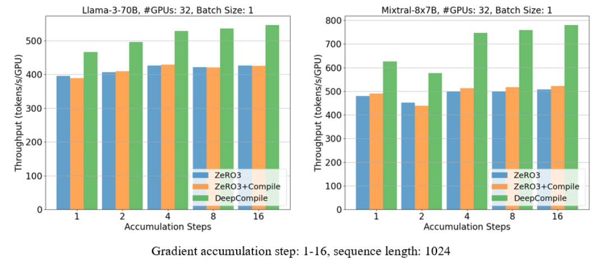
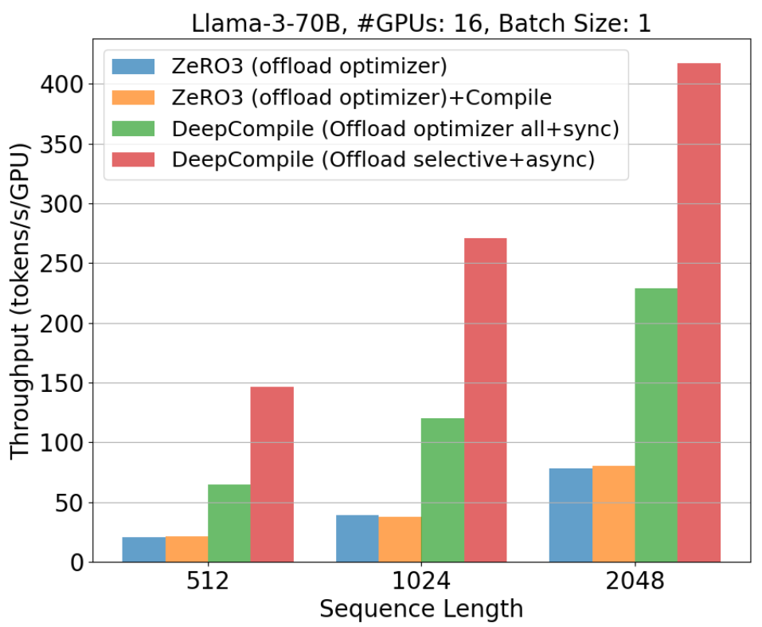
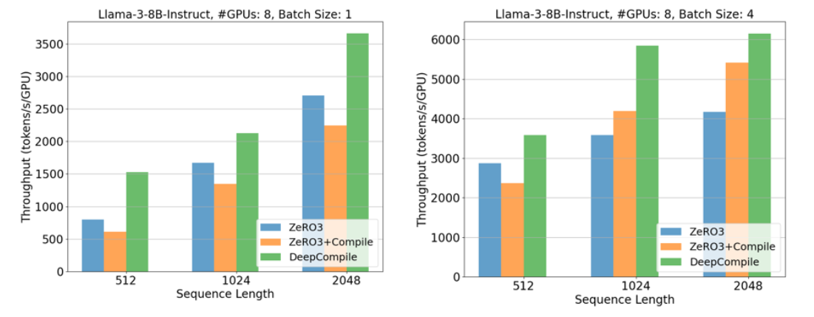

# DeepCompile: Unlocking Compiler Optimization for Distributed Training

# Introduction

Distributed training has become essential for scaling today’s massive deep learning models. While deep learning compilers like PyTorch compiler dramatically improved single-GPU training performance through optimizations like kernel fusion and operator scheduling, they fall short when it comes to distributed workloads.
Existing distributed training frameworks such as DeepSpeed and FSDP have made large-scale model training feasible through advanced parallelization strategies. While powerful, their optimizations are implemented at Python framework level, which limits the ability to apply compiler-style techniques like dependency analysis or operator scheduling.

DeepCompile addresses this gap by enabling compiler-level optimizations for distributed training. It takes a standard single-GPU model implementation and transforms it into an optimized multi-GPU training graph without requiring changes to the model code. Unlike existing approaches, DeepCompile automatically applies parameter sharding, communication scheduling, and memory-aware execution at the compiler IR level, enabling global analysis and optimization that are difficult to express in traditional frameworks. Furthermore, during training, DeepCompile employs profile-guided optimization techniques to dynamically tune these parallelization strategies and improve training performance.

Our evaluation demonstrates that DeepCompile achieves up to 1.28× and 1.54× performance improvements over ZeRO-3 and FSDP baselines, respectively, and up to a 7.01× improvement in settings with limited GPU resources, using offloading.

# Design Overview

DeepCompile extends the capabilities of deep learning compilers to support distributed training. It starts from a standard single-GPU model implementation, such as those available on the Hugging Face model hub, and automatically transforms it by inserting necessary distributed training operations such as parameter sharding and communication primitives. Users are not required to embed any distributed logic into the model code.

The process begins by compiling the model into an intermediate representation (IR), which forms a computation graph. DeepCompile then applies a sequence of *optimization passes*, each responsible for a specific transformation of the computation graph or a targeted performance improvement, to incrementally introduce distributed behavior and optimize the graph. These include operations such as all-gather for sharded parameters or offloading of optimizer states, all while preserving the original computation semantics (Fig. 1).

*Figure 1: Workflow of compilation and optimization with DeepCompile.*

At its core, DeepCompile builds on two key capabilities:

- **Automatic parallelization**: DeepCompile allows optimization passes to rewrite the single-GPU computation graph into a distributed multi-GPU version, incorporating strategies such as ZeRO, FSDP, and more. This eliminates the need for manual implementation of distributed training logic, drastically reducing engineering effort.
- **Profile-guided performance tuning**: At runtime, DeepCompile collects profiling data such as operator-level memory usage and execution latency. It uses this information to dynamically schedule computation and communication operators. This enables effects such as improved overlap between communication and computation and the avoidance of memory bottlenecks. Fine-grained tuning through these optimization passes often leads to better performance than even manually engineered implementations.

Figure 2 illustrates the optimization cycle employed by DeepCompile. After the initial computation graph is generated by the compiler, DeepCompile profiles its behavior by measuring operator execution time, communication overhead, and memory usage throughout the forward and backward passes.

*Figure 2. Optimization cycle.*

Based on the collected profiling data, DeepCompile applies a sequence of optimization passes. These passes modify the computation graph by inserting, removing, or reordering operators to improve overall efficiency. The modified graph is then re-profiled, and this cycle of profiling and optimization is repeated.

Once a stable set of optimizations has been applied, the graph is deployed for actual training iterations. During execution, memory usage and other runtime characteristics may change. In such cases, DeepCompile can resume the profiling and optimization cycle according to the predefined schedule of passes, allowing the graph to adapt and maintain high performance.

# Optimizations

DeepCompile is designed as a general framework for applying and optimizing a wide range of parallelization strategies. In the following, we describe several optimizations that have been implemented as optimization passes within DeepCompile.

## ZeRO3

As an initial step, we have used DeepCompile to implement and enhance ZeRO-3-style optimizations at the compiler level. ZeRO-3 partitions model parameters, gradients, and optimizer states across devices, reducing memory usage and enabling large-scale training.

In conventional ZeRO-3 implementations, operations such as all-gather, reduce-scatter, and buffer release are typically inserted using Python hooks at runtime. DeepCompile replaces this approach by injecting these operations directly into the computation graph during compilation. This allows the compiler to determine their placement precisely, guided by both the static structure of the graph and runtime profiling information.

One of the key optimizations is **proactive prefetching**, which launches all-gather operations earlier in the computation based on memory usage profiling. This reordering increases the overlap between communication and computation, thereby improving throughput. In addition, small communication operations are often fused to reduce launch latency and improve efficiency.

Another optimization is **selective unsharding**, which keeps certain parameters in an unsharded form during the forward and backward passes when memory conditions permit. This reduces the frequency of all-gather operations and avoids redundant communication, particularly in scenarios where gradient accumulation is enabled.

## Offloading

DeepCompile also supports **adaptive offloading**, which offloads optimizer states to reduce GPU memory pressure. Unlike approaches that move all optimizer states, adaptive offloading identifies only the portions that exceed the memory limit—such as momentum and variance used by the Adam optimizer—and schedules data transfers to overlap with computation. This selective and asynchronous strategy minimizes overhead and enables efficient training even in memory-constrained environments.

## ZeRO1

ZeRO-1 differs from ZeRO-3 in that it shards only the optimizer states across devices, while keeping parameters and gradients fully replicated. This approach reduces memory usage with minimal changes to computation flow, making it a lightweight alternative for certain training scenarios.
DeepCompile implements ZeRO-1-style optimization by inserting reduce-scatter operations directly into the computation graph. By avoiding Python-level hooks, this graph-level integration reduces overhead and improves execution efficiency.

# Performance Improvements

## ZeRO-3

We evaluated DeepCompile on Llama-3-70B and Mixtral 8x7B using parameter sharding on top of Hugging Face model implementations.
Figure 3 shows training throughput (tokens/sec/GPU) across different gradient accumulation steps, using 32 H100 GPUs with a sequence length of 1024.
We compare DeepCompile against two baselines: DeepSpeed ZeRO-3 and ZeRO-3 with compiler support enabled (ZeRO3+Compile).
For DeepCompile, we enabled both proactive prefetching and selective unsharding during training, demonstrating the combined effect of these optimization passes.

 
Figure 3. Throughputs resulting from Llama-3 70B and Mixtral 8x7B models (ZeRO3)

Across both models, DeepCompile consistently delivers higher throughput. The benefit becomes more pronounced at higher accumulation steps, where the reduced frequency of parameter updates makes selective unsharding more effective. DeepCompile with proactive prefetching and selective unsharding achieves up to 1.28× speedup over ZeRO-3 on Llama-3-70B and 1.54× on Mixtral 8x7B.

Meanwhile, enabling the PyTorch compiler with ZeRO-3 introduces minor overhead in some settings. This is because ZeRO-3 includes many conditional branches for runtime features such as prefetching. When the compiler encounters branches that cannot be statically resolved, it splits the computation into multiple graph segments. These fragmented segments can reduce optimization opportunities and introduce additional overhead during execution.

## Offloading

Training models as large as Llama-3 70B with ZeRO-3 typically requires 32 GPUs with 80GB of memory.
DeepSpeed addresses this challenge by offering offloading capabilities, which transfer optimizer states and parameters to CPU memory to reduce GPU memory usage. DeepCompile also supports offloading through a dedicated optimization pass, but with a few key differences in design.

Specifically, DeepCompile targets only the Adam optimizer's states (momentum and variance) and the master parameters for mixed precision (FP32), leaving the parameter updates on the GPU. It profiles memory usage during both forward and backward passes to identify when offloading is necessary, and transfers only the minimal required data. This fine-grained approach avoids unnecessary overhead and helps maintain high computational throughput.
Furthermore, DeepCompile overlaps data transfers with computation whenever possible, dynamically adjusting the timing based on observed memory usage patterns. This asynchronous behavior is a crucial aspect of DeepCompile’s offloading strategy, allowing it to reduce GPU memory pressure without stalling execution.

Figure 4 presents the results of our evaluation.

*Figure 4. Performance with optimizer offloading for Llama-3 70B on 8x80GB GPUs*

For baseline comparison, we include DeepCompile (Offload optimizer all+sync), which synchronously offloads all Adam optimizer states and FP32 master parameters before the forward pass and reloads them after the backward pass.
In contrast, DeepCompile (Offload selective+async), which enables adaptive offloading, uses profiling data to offload only the necessary data and performs asynchronous data transfers to overlap with computation.

As shown in the figure, DeepCompile (Offload selective+async) achieves up to a 7.0× speedup over standard ZeRO-3 in resource-constrained settings. Compared to DeepCompile (Offload optimizer all+sync), the more selective and asynchronous approach yields up to 2.3× better performance, highlighting the benefits of minimizing data transfers and overlapping them with compute.

## ZeRO-1

We also evaluated DeepCompile with ZeRO-1 using the Llama-3-8B model.
In our experiment with 8 GPUs and a batch size of 2, DeepCompile achieved consistent throughput improvements across different sequence lengths, as shown in Figure 5.

*Figure 5. Throughputs resulting from Llama-3 8B and Mixtral 8x7B models (ZeRO1)*

The most significant speedup was observed with batch size 1 and sequence length 512, where DeepCompile outperformed standard ZeRO-1 by up to 1.9×, and ZeRO-1 with compiler support (ZeRO-1+Compile) by up to 2.5×.

While compiler-based optimization can be effective for large batch sizes and long sequences by replacing suboptimal operations with more efficient kernels, it may also introduce overhead in ZeRO-1-style training. Naively applying compiler passes can fragment the computation graph, especially around communication operations, resulting in synchronization overhead. This overhead becomes more pronounced with smaller batch sizes and shorter sequences, where ZeRO-1 without compiler support can sometimes outperform its compiled counterpart.

In contrast, DeepCompile inserts communication operators directly into the computation graph during compilation, avoiding graph fragmentation and minimizing associated overhead. This makes DeepCompile more robust to small-scale workloads, while still benefiting from compiler-level optimization.

## Additional Results and Analysis

Please refer to our [arXiv paper](https://placeholder) for additional results, such as detailed comparisons across different batch sizes, sequence lengths, and memory usage.

# Looking Ahead

DeepCompile brings the power of compiler-based optimization to distributed deep learning. By transforming computation graphs and applying profile-guided optimization passes, it enables more efficient training without requiring changes to model code.

This release is just the beginning. We’re actively working on expanding the set of optimization passes and improving integration with a broader range of distributed training strategies. Future directions include automated parallelization (sequence/tensor parallelisms), smarter memory management, and dynamic adaptation to runtime behavior.

We invite the community to try DeepCompile, explore its capabilities, and contribute to its evolution. Let’s build the next generation of scalable deep learning together.

# Contributors
This project is the result of a close collaboration between Microsoft and the University of Virginia. The contributors are: Masahiro Tanaka, Olatunji Ruwase, Du Li, and Umesh Chand (formerly at Microsoft, now at AMD); and Ali Zafar and Haiying Shen (University of Virginia).

# Appendix

## Examples and Benchmarks

Our DeepSpeedExamples repository provides [example code](https://github.com/deepspeedai/DeepSpeedExamples/tree/tohtana/bench_deepcompile/benchmarks/deepcompile) to enable DeepCompile.

## Optimization Passes
The following optimization passes are currently available in DeepCompile:
- All-gather & reduce-scatter insertion (ZeRO3)
- Proactive prefetching (ZeRO3)
- Selective unsharding (ZeRO3)
- Reduce-scatter insertion (ZeRO1)
- Adaptive offloading

We used the following combinations of passes in the experiments presented above:
- Improved communication scheduling for ZeRO-3: All-gather & reduce-scatter → Proactive prefetching → Selective unsharding
- Offloading optimizer states for ZeRO3: Adding all-gather & reduce-scatter → Adaptive offloading
- Reduced overhead and improved overlap for ZeRO-1: Adding reduce-scatter
