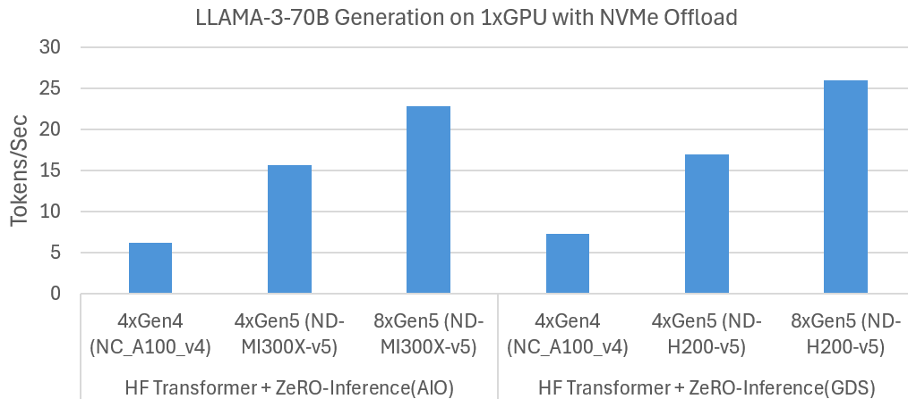
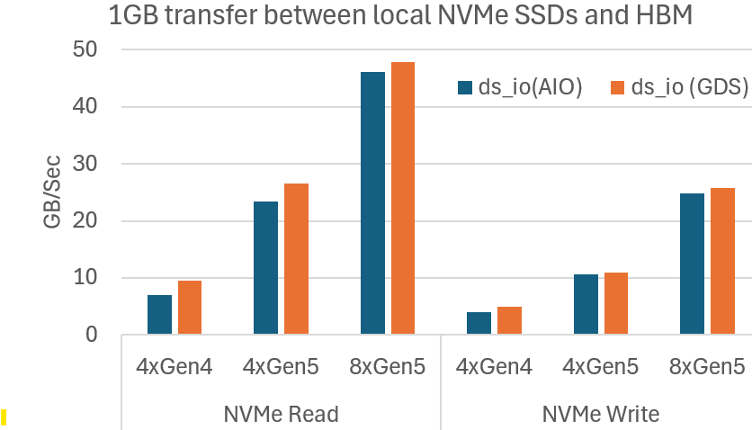

<div align="center">

# DeepNVMe: Cost-effective I/O scaling for Deep Learning Applications.

</div>

# Introduction
We introduced [DeepNVMe](https://github.com/deepspeedai/DeepSpeed/blob/master/blogs/deepnvme/08-2024/README.md) in summer 2024 as a suite of optimizations for tackling I/O bottlenecks in Deep Learning (DL). DeepNVMe delivers significant speedups for I/O bound DL workloads by leveraging storage innovations including local NVMe SSDs, NVIDIA Magnum IO<sup>TM</sup> GPUDirect® Storage (GDS), and Linux Asynchronous I/O (libaio). 
In this update, we are delighted to announce DeepNVMe improvements on multiple fronts: (i) expanding application coverage to FastPersist model checkpointing and SGLang inference, (ii) I/O performance scaling by switching from PCIe Gen4 NVMe SSDs to Gen5 NVMe SSDs, and (iii) expanding usability to CPU-only environments and offset-based I/O operations. The results reported in this blog are available in DeepSpeed versions >= XXX. 

# Evaluation environments
Our experiments are conducted on Azure using VMs from the [ND-H200-v5](https://learn.microsoft.com/en-us/azure/virtual-machines/sizes/gpu-accelerated/nd-h200-v5-series?tabs=sizebasic) and [ND-MI300X-v5](https://learn.microsoft.com/en-us/azure/virtual-machines/sizes/gpu-accelerated/ndmi300xv5-series?tabs=sizebasic) SKUs. The key software configurations are summarized in the following table. 

|Software | Version 
|---|--|
|PyTorch | 2.6.0+cu126|
|CUDA | 12.6 |
|Ubuntu | 24.0.2|


# Addressing I/O Bottlenecks of Deep Learning
We used DeepNVMe to develop FastPersist and ZeRO-Inference to target I/O bottlenecks in DL training and inference respectively. 

## FastPersist: Faster Model Checkpoint Creation
Saving model checkpoints to persistent storage is critical in model training, however, it is also a major bottleneck due to the inefficiencies of existing approaches. We developed [FastPersist](https://arxiv.org/abs/2406.13768) to address the performance challenges of model checkpointing. FastPersist makes checkpointing overheads negligible during training through three key techniques: (i) DeepNVMe, (ii) data parallelism, and (iii) overlapping I/O and computation. Our goal here is to demonstrate the impact of DeepNVMe on FastPersist, and we do this using single-process micro-benchmarks (available [here](https://github.com/deepspeedai/DeepSpeedExamples/tree/master/deepnvme/fastpersist)) which serialize (i) a PyTorch tensor, and (ii) model checkpoint state from HBM to local NVMe. We use the popular PyTorch `torch.save()` as the baseline in our experiments. For easy comparisons and adoption, we have integrate FastPersist into `torch.save()`. We configure the local storage by combining four and eight Gen5 NVMe SSDs into a single RAID-0 volume to leverage the aggregate write bandwidths. 


### Faster Saving of PyTorch Tensors to local NVMe SSDs
We measure the achieved throughput for writing 100MB, 1GB, and 10GB tensors from HBM to local NVMe storage. We summarize the results in the Figure below. We observe that FastPersist provides significant speedups over the baseline, achieving over 20X faster writes in the case of 10GB tensor on 8xGen5 NVMes. Moreover, we observe that FastPersist performance scales with available NVMe bandwidth, i.e., comparing 4xGen5 with 8xGen5.   


<div align="center">
  FastPersist significantly accelerates writes of Pytorch Tensors to local NVMe from HBM. 
</div>


### Faster Saving of PyTorch Models to local NVMe SSDs
We measure the throughput of serializing Phi-3-Mini checkpoint state from HBM to local NVMe storage. The results are summarized in the Figure below. We observe significantly faster checkpointing with FastPersist compared to the baseline. We see speedups of over 20X in the 8xGen5 NVMe settings. We also observe FastPersist scaling with increased NVMe bandwidth of 8xGen5 compared with 4xGen5. 


<div align="center">
  FastPersist provides significantly faster model checkpointing to local NVMe.
</div>

## ZeRO-Inference: Democratizing Generative AI
[ZeRO-Inference]() is a technique for democratizing access to state-of-the-art models by reducing the GPU costs of model inference. ZeRO-Inference enables inference computations of massive models (hundreds-of-billions of parameters) on as few as one GPU by offloading the model weights to DRAM and NVMe storage. ZeRO-Inference is designed for offline or throughput-oriented inference scenarios. In this blog, we share two updates on ZeRO-Inference. First, we have integrated ZeRO-Inference into SGLang, a state-of-the-art model serving framework. Second, we observed ZeRO-Inference performance scales with the faster NVMe SSDs in the latest Azure SKUs. 

### Democratizing SGLang through ZeRO-Inference integration
[SGLang](https://docs.sglang.ai/) is a state-of-the-art serving framework for large language models (LLMs) and vision language models (VLMs). Our integration of ZeRO-Inference into SGLang makes SGLang available to budget-constrained users, and offers a cost-reduction option for existing SGLang users. 

### Scaling HF Transformer Generation with Faster NVMe SSDs
We previously [evaluated](https://github.com/deepspeedai/DeepSpeed/blob/master/blogs/deepspeed-gds/README.md#high-performance-offloading-via-nvme-scaling)  LLAMA-3-70B generation on single GPU using HF Transformer inference and NVMe offloading. That experiment measured the generation speed for a prompt of 512 tokens, output of 32 tokens, and batch size 96. We used an Azure [NC_A100_v4](https://learn.microsoft.com/en-us/azure/virtual-machines/sizes/gpu-accelerated/nca100v4-series?tabs=sizebasic) VM with four Gen4 NVMes. Since NVMe bandwidth was the main bottleneck, we now repeat the experiment on newer Azure SKUs with eight Gen5 NVMes(ND-MI300X-v5 and ND-H200-v5). The results summarized in the Figure below show that ZeRO-Inference effectively exploits the increased NVMe bandwidths to improve generation speeds. For example, with GDS, generation speed improves from 7 tokens per second with four Gen4 NVMes to 17 with four Gen5 NVMes, and further to 26 with eight Gen5 NVMes. We observe similar improvements without GDS. These results show that ZeRO-Inference performance can be improved in cost-effective manner by increasing NVMe bandwidths. 


<div align="center">
  ZeRO-Inference leverages available NVMe bandwidth to scale LLAMA-3-70B generation. 
</div>


# I/O performance scaling
We used our `ds_io` benchmarking tool to demonstrate DeepNVMe proportionally scaling I/O performance with available NVMe bandwidths. This empowers users to accelerate I/O bound DL applications at modest cost using more or faster NVMe SSDs. In our experiments, we measure the achieved read and write bandwidths of 1GB data transfers between HBM and NVMes. We evaluate scaling up NVMes from PCIe Gen4 to Gen5, and scaling out from 4 to 8 SSDs. The SSDs are combined into a single RAID-0 volume. We summarize the results in the Figure below which show that DeepNVMe scales I/O performance on both dimensions. Scaling up from 4xGen4 SSDs to 4xGen5 SSDs improves reads from 10GB/sec to 27GB/sec, and writes from 5GB/sec to 11GB/sec. Scaling out from 4xGen5 to 8xGen5 further improves reads to 48GB/sec, and writes to 26GB/sec. 


<div align="center">
  Microbenchmark shows DeepNVMe scales I/O performance with available NVMe bandwidth
</div>


# Broader usability
We have increased the usage scenarios of DeepNVMe by removing restrictions regarding hardware environments and I/O operations, as explained below. 

## CPU-Only environments
Although GPUs (and similar accelerators) dominate DL, CPUs are still used in important machine learning (ML) workloads such as recommendation systems. However, DeepNVMe was previously unusable in CPU-only environments. This was because DeepNVMe relied on `torch.pin_memory()` for page-locked CPU tensors, whereas `torch.pin_memory()` does not work in the CPU versions of `torch` as illustrated below. 

```bash
>>> import torch
>>> torch.__version__
'2.6.0+cpu'
>>> x = torch.empty(1024).pin_memory()
Traceback (most recent call last):
  File "<stdin>", line 1, in <module>
RuntimeError: Cannot access accelerator device when none is available.
>>> 
```

We have made DeepNVMe usable in CPU environments by adding mechanisms for allocating (`new_cpu_locked_tensor()`) and releasing (`free_cpu_locked_tensor()`) page-locked CPU tensors. The snippet below illustrates allocating a pinned CPU tensor (`x`).

```bash
>> import torch
>>> torch.__version__
'2.6.0+cpu'
>>> from deepspeed.ops.op_builder import AsyncIOBuilder
>>> h = AsyncIOBuilder().load().aio_handle()
>>> x = h.new_cpu_locked_tensor(1024, torch.Tensor())
>>> x.shape
torch.Size([1024])
>>> x.dtype
torch.float32
```


## Offset-based I/O operations
Previously, DeepNVMe functionality was restricted to reading or writing the entire contents of a file. We have now improved DeepNVMe to read or write a user-specified portion of file content from a given offset. In particular, we have extended the existing read/write APIs to accept a user-specified `file offset` argument (with default value 0) such as below: 

```bash
>> from deepspeed.ops.op_builder import AsyncIOBuilder
>>> help(AsyncIOBuilder().load().aio_handle().pread)
Help on method pread in module async_io:

pread(...) method of async_io.aio_handle instance
    pread(self: async_io.aio_handle, buffer: torch.Tensor, filename: str, validate: bool, async: bool, file_offset: int = 0) -> int
```


# Summary
This blog post has provided updates on our continued development of DeepNVMe, an I/O optimization technology for accelerating DL applications. We have announced DeepNVMe improvements on multiple aspects, including application coverage, I/O performance scaling, and usability. 
